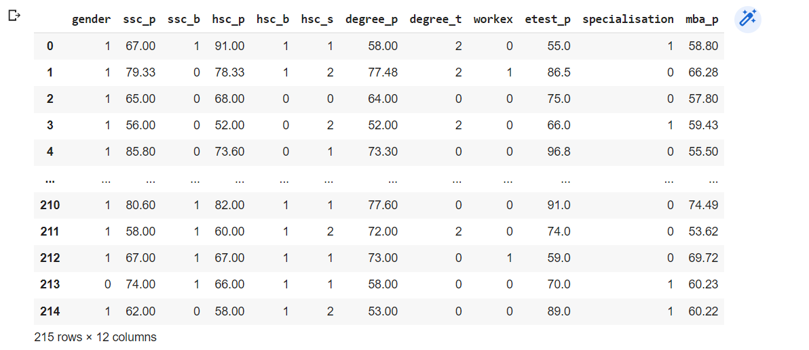
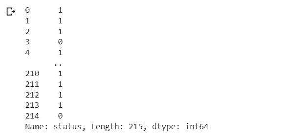

 # Implementation-of-Logistic-Regression-Model-to-Predict-the-Placement-Status-of-Student

## AIM:
To write a program to implement the the Logistic Regression Model to Predict the Placement Status of Student.

## Equipments Required:
1. Hardware – PCs
2. Anaconda – Python 3.7 Installation / Jupyter notebook

## Algorithm
## STEPS INVOLVED
#### 1.Data Preparation: The first step is to prepare the data for the model. This involves cleaning the data, handling missing values and outliers, and transforming the data into a suitable format for the model.

#### 2.Split the data: Split the data into training and testing sets. The training set is used to fit the model, while the testing set is used to evaluate the model's performance.

#### 3.Define the model: The next step is to define the logistic regression model. This involves selecting the appropriate features, specifying the regularization parameter, and defining the loss function.

#### 4.Train the model: Train the model using the training data. This involves minimizing the loss function by adjusting the model's parameters.

#### 5.Evaluate the model: Evaluate the model's performance using the testing data. This involves calculating the model's accuracy, precision, recall, and F1 score.

#### 6.Tune the model: If the model's performance is not satisfactory, you can tune the model by adjusting the regularization parameter, selecting different features, or using a different algorithm.

#### 7.Predict new data: Once the model is trained and tuned, you can use it to predict new data. This involves applying the model to the new data and obtaining the predicted outcomes.

#### 8.Interpret the results: Finally, you can interpret the model's results to gain insight into the relationship between the input variables and the output variable. This can help you understand the factors that influence the outcome and make informed decisions based on the results.

## Program:
```
/*
Program to implement the the Logistic Regression Model to Predict the Placement Status of Student.
Developed by: Kamalesh SV
RegisterNumber: 212222240041

import pandas as pd
data=pd.read_csv("/content/Placement_Data.csv")
data.head()

data1=data.copy()
data1=data1.drop(["sl_no","salary"],axis=1)#Browses the specified row or column
data1.head()

data1.isnull().sum()

data1.duplicated().sum()

from sklearn.preprocessing import LabelEncoder
le=LabelEncoder()
data1["gender"]=le.fit_transform(data1["gender"])
data1["ssc_b"]=le.fit_transform(data1["ssc_b"])
data1["hsc_b"]=le.fit_transform(data1["hsc_b"])
data1["hsc_s"]=le.fit_transform(data1["hsc_s"])
data1["degree_t"]=le.fit_transform(data1["degree_t"])
data1["workex"]=le.fit_transform(data1["workex"])
data1["specialisation"]=le.fit_transform(data1["specialisation"] )     
data1["status"]=le.fit_transform(data1["status"])       
data1 

x=data1.iloc[:,:-1]
x

y=data1["status"]
y

from sklearn.model_selection import train_test_split
x_train,x_test,y_train,y_test=train_test_split(x,y,test_size=0.2,random_state=0)

from sklearn.linear_model import LogisticRegression
lr=LogisticRegression(solver="liblinear")
lr.fit(x_train,y_train)
y_pred=lr.predict(x_test)
y_pred

from sklearn.metrics import accuracy_score
accuracy=accuracy_score(y_test,y_pred)
accuracy

from sklearn.metrics import confusion_matrix
confusion=confusion_matrix(y_test,y_pred)
confusion

from sklearn.metrics import classification_report
classification_report1 = classification_report(y_test,y_pred)
print(classification_report1)

lr.predict([[1,80,1,90,1,1,90,1,0,85,1,85]])  
*/
```

# Output:

### 1.Placement Data


### 2.Salary Data


### 3. Checking the null function()


### 4.Data Duplicate


### 5.Print Data



### 6.Data Status


### 7.y_prediction array


### 8.Accuracy value


### 9.Confusion matrix


### 10.Classification Report


### 11.Prediction of LR


## Result:
Thus the program to implement the the Logistic Regression Model to Predict the Placement Status of Student is written and verified using python programming.
